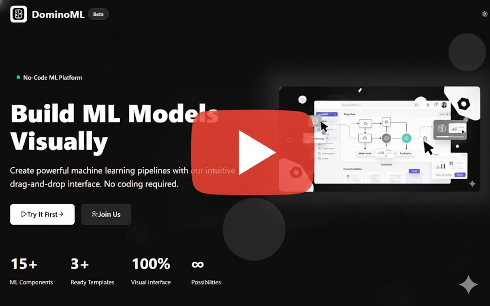
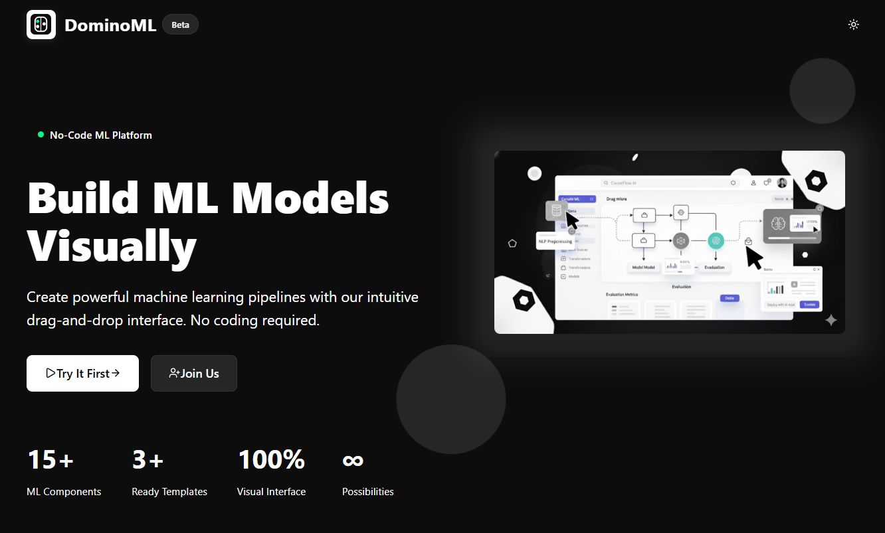
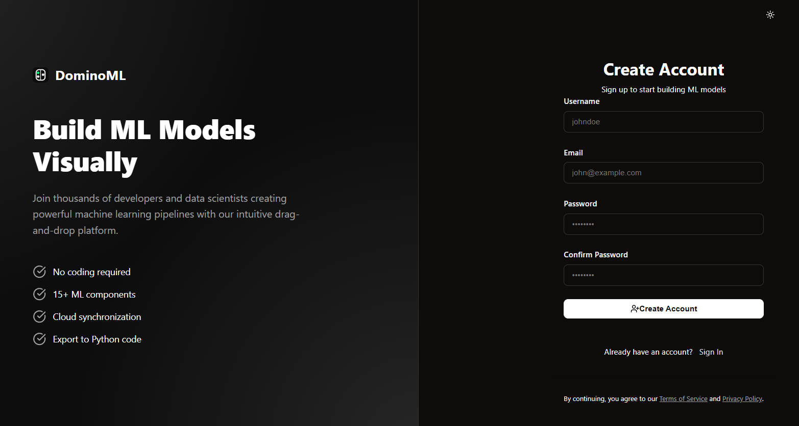
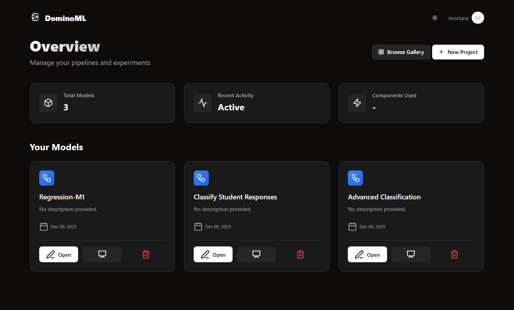
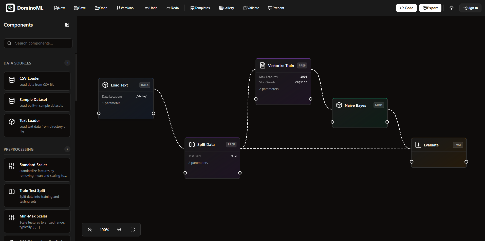
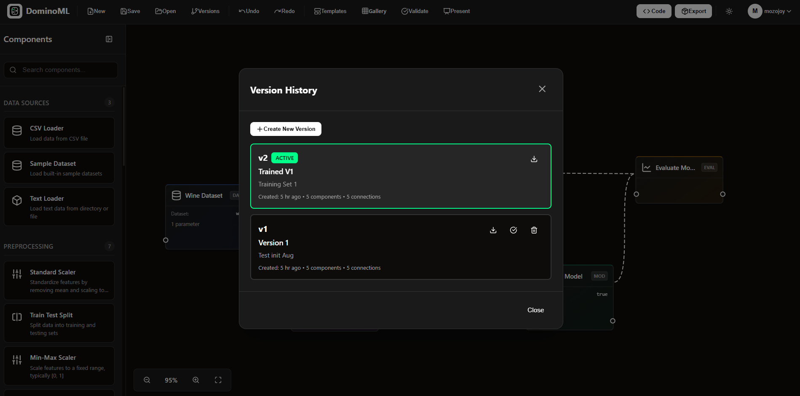
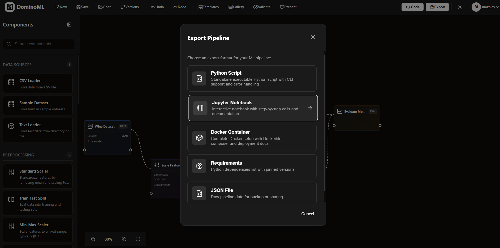
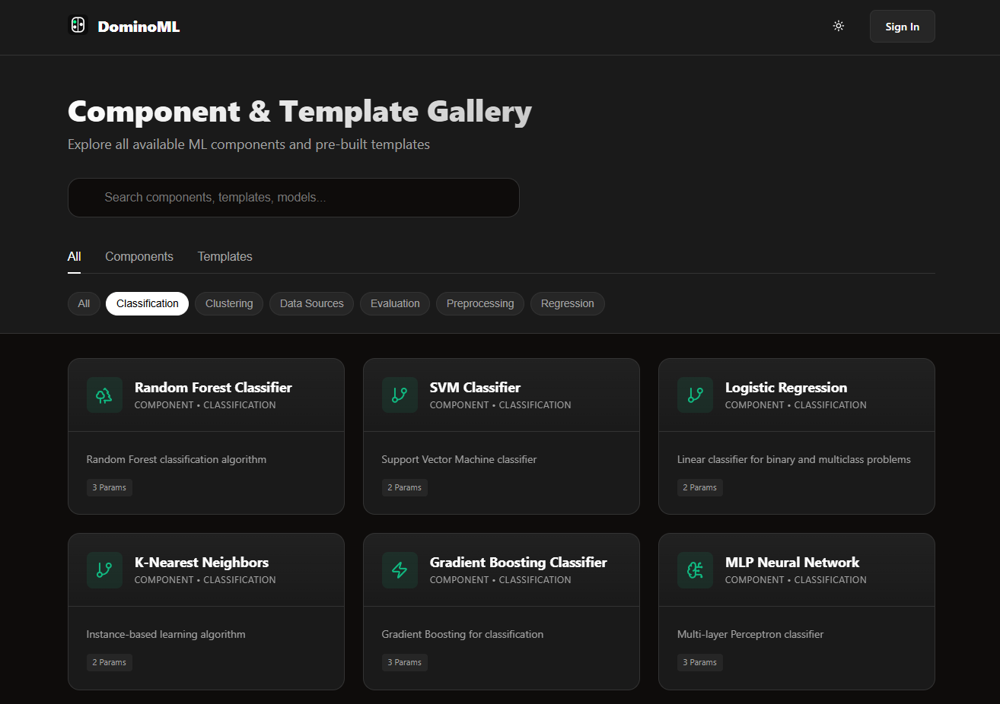
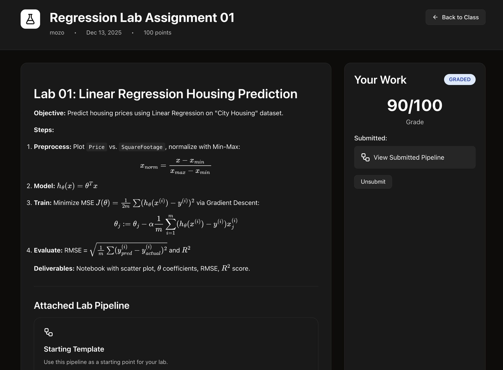

[](https://domino-ml.onrender.com)
[](https://www.python.org/)
[](https://flask.palletsprojects.com/)

# DOMINO ML
**VISUAL MACHINE LEARNING PIPELINE BUILDER**

### > [LAUNCH LIVE DEMO ↗](https://domino-ml.onrender.com)

A Flask-based visual machine learning pipeline builder that enables users to create ML workflows through an intuitive drag-and-drop interface. Build complete custom ML pipelines visually and generate production-ready Python code automatically. Now featuring a comprehensive **LMS (Learning Management System)** for data science education.

---


## VIDEO DEMO

[](https://youtu.be/FNp3avbL1t0)

> *Click the image above to watch the walkthrough*

---

## VISUAL TOUR


### 1. LANDING EXPERIENCE


### 2. AUTHENTICATION


### 3. PROJECT DASHBOARD


### 4. PIPELINE BUILDER CANVAS


### 5. VERSION CONTROL


### 6. IMPORT / EXPORT


### 7. TEMPLATE GALLERY


### 8. CLASSROOM MANAGEMENT


### 9. ASSIGNMENTS & LABS


---

## FEATURES

### CORE
- **DRAG & DROP INTERFACE**: Visual pipeline builder with vanilla JavaScript.
- **COMPONENT LIBRARY**: Extensive collection of ML components.
- **CODE EXPORT**: Generate Python code from visual pipelines.
- **TEMPLATE GALLERY**: Pre-built ML pipeline templates.
- **REAL-TIME VALIDATION**: Model structure validation.

### EDUCATIVE LMS (NEW)
- **CLASSROOM MANAGEMENT**: Create digital classrooms, manage students, and distribute invite codes.
- **INTERACTIVE LABS**: Attach actual **ML Pipelines** to assignments. Students can "fork" templates and experiment.
- **MARKDOWN & LATEX**: Rich assignment instructions with full mathematical typesetting support ($E=mc^2$).
- **GRADING SYSTEM**: Review student pipelines, provide feedback, and assign grades directly.

### SCIENTIFIC ZEN UI
- **GLASSMORPHISM**: Modern, sleek interface designed for focus.
- **THEMED MODES**: Switch between "Lab Paper" (Light) and "Deep Space" (Dark) themes.
- **RESPONSIVE DESIGN**: Optimized experiences for desktop and mobile.

### ADDITIONAL
- **USER AUTHENTICATION**: Secure login/signup.
- **CLOUD STORAGE**: Save models in SQLite database.
- **UNDO/REDO SYSTEM**: Smart state management for canvas operations.
- **PIPELINE VERSIONING**: Full version tracking and comparison.

---

## QUICK START

### PREREQUISITES
- Python 3.8+
- pip
- Modern Web Browser

### INSTALLATION

1. **CLONE**
   ```bash
   git clone https://github.com/1mystic/dominoML-flask.git
   cd dominoML-flask
   ```

2. **VIRTUAL ENV**
   ```bash
   python -m venv venv
   # Windows
   venv\Scripts\activate
   # Mac/Linux
   source venv/bin/activate
   ```

3. **DEPENDENCIES**
   ```bash
   pip install -r requirements.txt
   ```

4. **CONFIGURE**
   ```bash
   cp .env.example .env
   # Edit .env with your settings
   ```

5. **INIT DB**
   ```bash
   python
   >>> from app import create_app, db
   >>> app = create_app()
   >>> with app.app_context():
   ...     db.create_all()
   >>> exit()
   ```

6. **RUN**
   ```bash
   python run.py
   ```
   Visit `http://localhost:5000`

---

## PROJECT STRUCTURE

```
Domino_ML/
├── app/                  # Flask application
│   ├── data/            # Components & Templates
│   ├── routes/          # Blueprints (Auth, Main, LMS)
│   ├── static/          # CSS/JS Assets
│   └── templates/       # Jinja2 Views
├── migrations/          # DB Migrations
├── config.py            # App Config
└── run.py               # Entry Point
```

---

## TECHNOLOGY STACK

**BACKEND**
- Flask 3.0
- SQLAlchemy (SQLite)
- Flask-Login
- Flask-WTF

**FRONTEND**
- Jinja2 Templates
- Custom CSS (Scientific Zen Theme)
- Vanilla JavaScript
- Lucide Icons
- Marked.js + MathJax (Educational Content)

---

## LICENSE
Not yet licensed.

---

**BUILT WITH 🖤 FOR THE ML COMMUNITY** by @1mystic
